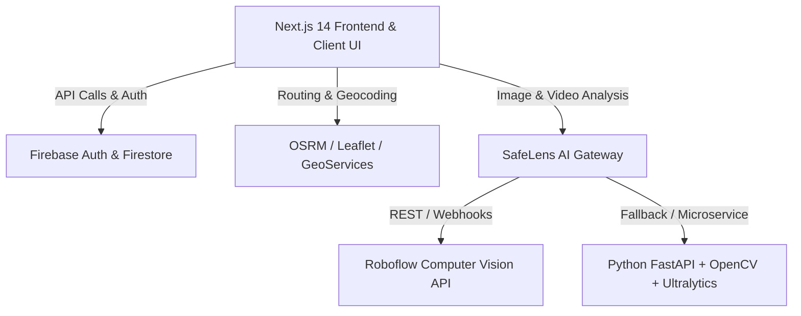

# 🛡️ SafeLens — Intelligent Women Safety Route & AI Surveillance Platform

> **Real-time AI-powered navigation, dynamic crowd density analysis, Roboflow CCTV person detection, and emergency dispatch system.**

---

## 🌟 Overview

**SafeLens** (Women Safety Route System) is a full-stack platform designed to empower women and citizens with intelligent, safety-optimized route navigation and real-time smart surveillance.

Combining **Next.js 14**, **Firebase Firestore**, **Leaflet Geolocation**, **Roboflow Computer Vision API (`people-detection-o4rdr/12`)**, and a **Python FastAPI Inference Engine**, SafeLens analyzes crowd density, road lighting, CCTV feeds, and verified police/safe-haven checkpoints to calculate the safest pedestrian and transit routes.

---

## ✨ Key Features

- 🗺️ **Safe Route Navigation**: Multi-factor routing algorithm considering street lighting, crowd activity, police coverage, and community reports.
- 👁️ **CCTV AI Person Detection & Density Engine**: Integrates with Roboflow Hosted Inference API (`detect-persons-bghyp/4` / `people-detection-o4rdr/12`) to detect individuals and calculate crowd safety scores in real-time.
- 📹 **Live Video & Image Inspector**: Upload photos or surveillance video clips to get automated safety metrics, bounding boxes, and activity level classification (`LOW`, `MODERATE`, `HIGH`, `VERY HIGH`).
- 🚨 **Emergency SOS & Quick Dispatch**: Instant one-tap SOS trigger broadcasting real-time location to emergency contacts and nearby authorities.
- 📊 **Administrative Safety Command Center**: Live overview of city zones (Karur & metropolitan areas), active alerts, CCTV health statuses, and crowd heatmap overlays.
- ⚡ **Light & Dark Mode UI**: Modern SaaS aesthetics built with Tailwind CSS, Lucide Icons, and responsive design for mobile & desktop.

---

## 🏗️ Architecture & Tech Stack



### Frontend & Gateway
- **Framework**: [Next.js 14](https://nextjs.org/) (App Router, Server Actions)
- **Styling**: [Tailwind CSS](https://tailwindcss.com/)
- **Icons**: [Lucide React](https://lucide.dev/)
- **Maps**: [Leaflet](https://leafletjs.com/) & [React-Leaflet](https://react-leaflet.js.org/)
- **Database & Auth**: [Firebase](https://firebase.google.com/) (Firestore & Authentication)

### AI & Surveillance Backend
- **Microservice**: [FastAPI](https://fastapi.tiangolo.com/) (Python 3.11–3.13)
- **Vision Models**: Roboflow REST API & Ultralytics YOLOv8
- **Video Processing**: OpenCV & PyAV

---

## 🚀 Getting Started

### 1. Prerequisites
- **Node.js**: v18.x or v20.x+
- **Python**: v3.11 to v3.13 (or via `uv`)
- **Git**

### 2. Clone Repository
```bash
git clone https://github.com/bsvasudevsarvajith/SafeLens.git
cd SafeLens
```

### 3. Environment Configuration
Copy the example environment file and configure your keys:
```bash
cp .env.example .env.local
```

Ensure the following variables are configured:
```env
NEXT_PUBLIC_FIREBASE_API_KEY=your_firebase_api_key
NEXT_PUBLIC_FIREBASE_AUTH_DOMAIN=your_project.firebaseapp.com
NEXT_PUBLIC_FIREBASE_PROJECT_ID=your_project_id
NEXT_PUBLIC_FIREBASE_STORAGE_BUCKET=your_project.appspot.com
NEXT_PUBLIC_FIREBASE_MESSAGING_SENDER_ID=your_messaging_sender_id
NEXT_PUBLIC_FIREBASE_APP_ID=your_app_id

ROBOFLOW_API_KEY=your_roboflow_key
ROBOFLOW_MODEL_ID=detect-persons-bghyp/4
AI_PROVIDER=roboflow
AI_API_URL=http://127.0.0.1:8000
AI_API_KEY=wsrs_super_secret_ai_key_2026
```

### 4. Install Dependencies & Run

#### Next.js Web App
```bash
npm install
npm run dev
```
Open [http://localhost:3000](http://localhost:3000) in your browser.

#### Python AI Service (Optional for local video inference)
```bash
uv venv .venv
uv pip install -r ai-service/requirements.txt
.venv\Scripts\uvicorn ai-service.main:app --port 8000 --reload
```

---

## 🔒 Security & Privacy
- Sensitive credentials (`.env`, API tokens) are strictly excluded via `.gitignore`.
- Video streams and image uploads are processed in-memory or ephemeral storage without storing identifying biometric records.

---

## 📄 License
MIT License © 2026 SafeLens Team